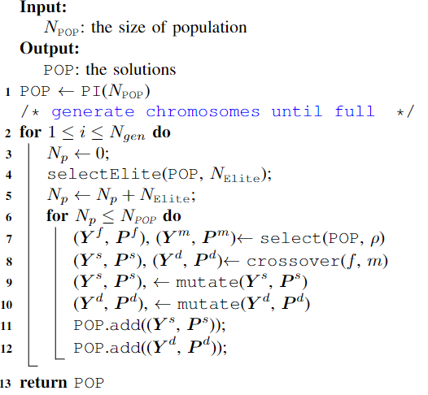
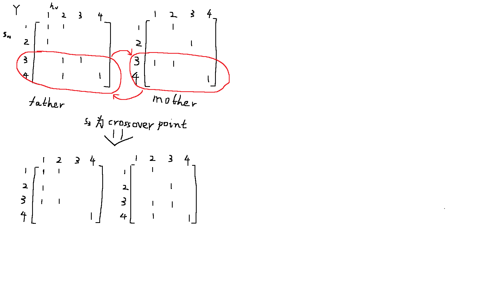

# 实验设计

### 1.类设计

- 在该实验中，只需设计很简单的类，储存在生成后就不会发生改变的常量。
***
- **服务（Service）:**
  1. 服务编号w（int，从0开始）
  2. 请求数据大小d（double）
  3. 服务实例的请求处理速度μ（double）
***
- **边缘设备（基类，包括接入点（AccessPoint）、服务器（Server）和剩余设备（Switch））:**
  1. 设备编号（int，从0开始）
***
- **接入点（AccessPoint, 继承边缘设备类）:**
  1. 各服务查询率（double数组，长度为服务种类数，单位是qps）
  2. 该接入点的无线传输速率v_q(double)
***
- **服务器（Server，继承边缘设备类）:**
  1. 可放置实例数量的上限（int） 
***
- **剩余设备（继承边缘设备类）:**

### 2.其他常量设计
- 网络拓扑结构Z：二维邻接矩阵(double)，规模为 V * V,  V是边缘设备数量。若元素(u,v)值为0则代表uv之间无连接，若(u,v)>0则其值代表uv之间的传输速率（在对P赋值时赋1）。
- C_budget，总资金（double）
- L1、L2 ，最大不平衡度（double）
- 种群规模 N_POP （int）
- 变异概率prob
- 可能还有忘了的
### 3.流程设计
- 首先生成上述提到的所有常量:
  - 对象生成顺序为   服务 -> 接入点 -> 服务器 -> 剩余设备。用列表serviceList(S)和deviceList(V)存储。
  - 生成拓扑结构Z，Z为二维无向图邻接矩阵，且不应存在不可到达的节点（即不能出现某一行（列）的所有值均为0）。

- 初始化种群(参考论文 Algorithm 2):
  - 根据 serviceList(S)、deviceList(V)、邻接矩阵Z、各服务器实例上限（一维数组，长度为服务器数量，从deviceList中获得），用 Algorithm 3 获得N_POP个（P, Y）个体。
  - 关于Y矩阵：二维矩阵，规模为服务数量*服务器数量（不包括接入点和剩余设备），第一维是服务编号，第二维是（设备编号-接入点数量）
  - 每次在P生成或发生变化后，根据P、serviceList(S)、deviceList(V)获得一个当前路径列表paths
  - paths：一个三维列表，第一维是服务编号、第二维是接入点编号（因为先生成了接入点，所以接入点编号就是设备编号）、第三维是路径。
  - 例：path[0][1] = [1,8,7,13]、path[1][1] = [1,12] (Python列表里，路径长度不一样好像没事)

 
- 计算所有个体的 cost-performance ratio ρ(P, Y)
  - performance计算：详见论文 式-11、12、13
  - cost计算：详见论文 式-15~19
  - ρ(P, Y)：式-20

  
- 选择（Select）：轮盘赌
  - 选中(Pi, Yi)的概率为ρ(Pi, Yi)的倒数 / 种群中所有个体ρ(P, Y)的倒数之和（式-24）

- 交叉（crossover）：
  - (P_f, Y_f)和(P_m, Y_m)交叉，Y_f和Y2先交叉生成Y_son和Y_daughter，再经过Solution Heal过程，生成P_s和P_d

- Solution Heal：
  - 详见Algorithm 6~8

- 变异（Mutate）：
  - 根据随机数和变异概率prob判断是否发生变异
  - Positive mutation：在可用的服务器上生成一个新实例
  - Negative mutation：去掉一个非唯一的实例

- **总流程（Algorithm 1）：**

### 4.相关方法
1. 服务、边缘设备、邻接矩阵Z的相关生成方法（即获取实验数据）
  - getCapacity(deviceList): return capacity
    - 通过生成的deviceList获得各服务器容量向量capacity(即Y*，非必须，仅仅为了方便)
***

2. Population Initialization(N_pop):  return POP
  - 输入种群数量，输出种群
  ***
3. Chromosome Initialization(serviceList, deviceList, Z): return (P, Y)
  - 根据常值在约束之内随机生成一组(P, Y)
***
4. randAvailableMECServer(deviceList): return server
  - 随机返回一个实例没达到上限的服务器
***
5. randService(serviceList): return service
  - 随机返回一个服务
***
6. calCostPerformanceRatio(P, Y): return ρ
  - 计算个体(P, Y)的目标值
***
7. （待定）getPaths(?): return paths
  - 算出所有接入点的所有服务的路由路径
  - paths：一个三维列表，第一维是服务编号、第二维是接入点编号（因为先生成了接入点，所以接入点编号就是设备编号）、第三维是路径。
  - 例：path[0][1] = [1,8,7,13]、path[1][1] = [1,12] (Python列表里，路径长度不一样好像没事)
***
  
8. select(ρ): return i
  - ρ这里是一个列表（一维数组），存储了种群POP中所有个体的CostPerformanceRatio(double型)，根据论文式-24的概率随机返回一个个体（的序号）
  - 选中i的概率为ρ[i]的倒数 / 种群中所有个体ρ[0]~ρ[n]的倒数之和
***

9. Y_crossover(Y_f, Y_m): return Y_s, Y_d

***
10. solutionHeal(P, Y, capacity): return P', Y'
  - PVH(Y, capacity): return Y
    - 待补充
  - SPR(Y, capacity): return Y, migInfo
    - 待补充
  - NetR(Y, P): return P
    - 待补充
***
    
11. mutate(P, Y, capacity, prob_mutate): return P, Y
  - 根据变异概率进行变异